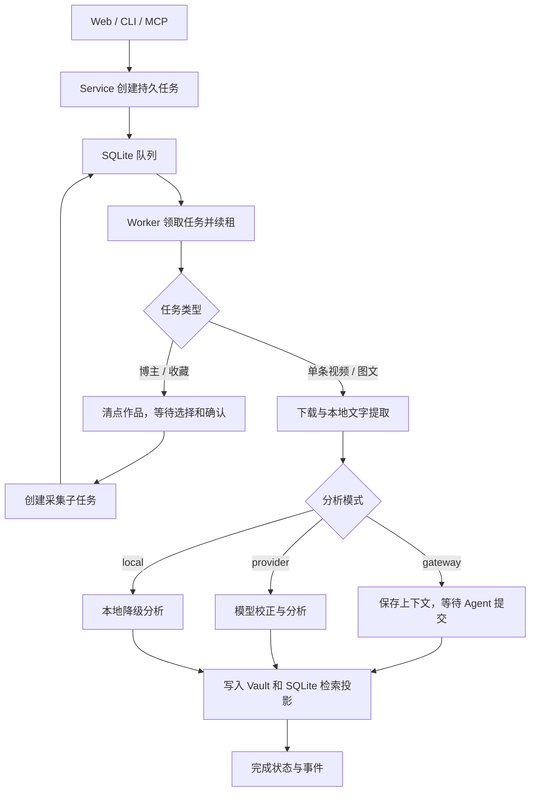

# 项目结构与处理流程

## 入口与分析模式

Web、CLI 和 MCP 共用 `DouyinWikiService`。Web 是日常操作入口，CLI 用于安装与排障，MCP 供外部 Agent 调用。入口不决定分析模式：

| 模式 | 校正与分析执行者 |
| --- | --- |
| `gateway` | 外部 Agent 获取上下文、提交校正版和分析；本地 Worker 暂停等待 |
| `provider` | 本地 Worker 调用配置的 OpenAI-compatible 模型接口 |
| `local` | 本地启发式分析，不调用模型 |



视频优先通过专用 Playwright Profile 获取媒体地址，再由下载工具落盘；失败时回退到页面下载。音轨由配置的 ASR 后端转录，视频抽帧与静态图文由 OCR 后端识字。`auto` 优先 SenseVoice 与 RapidOCR，初始化不可用时回退 Whisper 或 Vision；已有配置的兼容行为见根目录 README。

新视频由同一分析模型直接校正后继续入库，普通 ASR/OCR 疑点只记录，不新增人工复核步骤。旧 `needs_review` 任务可显式重试。授权失效、长视频需确认、模型错误等仍按对应任务状态处理。

## 文件职责

以下模块路径相对于 `src/douyin_wiki/`。

| 文件或目录 | 职责 |
| --- | --- |
| `cli.py`、`mcp_server.py`、`webapp/` | CLI、MCP 和本机 Web 入口 |
| `worker.py`、`runtime.py` | 队列调度、租约续期、失效任务恢复、代码更新检测 |
| `service.py`、`service_*.py` | 服务门面；采集、分析、批量导入、资料、维护、废纸篓六个 mixin |
| `database.py`、`vault.py` | SQLite 持久状态与索引；Markdown、侧车和 Vault Git |
| `favorites*.py` | 收藏清点、选择、幂等派发和批次汇总 |
| `adapters/` | 抖音解析与下载、媒体处理、模型、向量和系统提醒适配 |
| `search.py` | 证据分块、FTS 与向量检索、资料关系 |
| `web_auth.py`、`auth_guidance.py` | Web 授权会话与 macOS 授权引导 |
| `operation.py`、`web_operation.py` | 任务展示、授权状态与维护操作 |
| `config.py`、`setup.py`、`secrets.py` | 配置、安装检查、LaunchAgent 与密钥访问 |
| `models.py`、`errors.py` | 数据契约与稳定错误类型 |

## 状态与数据

用户 Vault 与源码仓库分离。Vault 保存不可变原始记录、可更新资料页、机器侧车和媒体；`.douyin-wiki/state.sqlite3` 保存任务、事件、授权会话、聊天及检索投影。重建知识索引不等于恢复全部操作历史。

同一作品采集使用作品锁；条目修改使用跨进程操作锁。Worker 发布资料时在数据库写事务内校验租约，再写文档与检索投影。重新分析、恢复媒体等耗时操作在最终发布前重新读取当前条目，保留期间产生的用户修改。相关调用约定见 [Service 协作 API](service-collaboration-api.md)。

定期维护由独立 LaunchAgent 调度，Worker 启动时补偿错过的维护。维护处理知识过期、孤立页面和媒体保留，不自动同步博主或收藏。Web 只监听本机回环地址。

## 开发验证

```bash
uv sync --extra dev
uv run ruff check src tests
uv run pytest -q -m 'not live'
```

`tests/conftest.py` 提供临时 Vault 与假适配器；浏览器回归使用隔离上下文和模拟网络。真实抖音冒烟需显式启用 `live`，前置条件见 `tests/test_live_smoke.py`。测试按接口、领域和恢复行为组织，不能因文件最初来自某轮审查就删除仍有效的回归用例。
