# 抖库当前项目流程图

> 按 2026-09-27 的本机配置和当前代码绘制。每个框的前缀与所在泳道一起标明执行者；模型名称写在实际推理节点上。主流程采用 `analysis_mode=provider`。

```mermaid
flowchart LR
    subgraph human ["你｜手动操作"]
        direction TB
        submit["你：提交分享链接、灵感、媒体保留选项"]
        submitBatch["你：发起博主或收藏夹批量导入"]
        selectBatch["你：查看清单、选择作品并确认导入"]
        login["你：抖音登录授权后重试任务"]
        approve["你：确认超时长视频或 AI 分析"]
        reviewVideo["你：校对有疑点的逐字稿"]
        reviewImage["你：校对有疑点的图片文字"]
        inspect["你：查看资料、搜索、按需创建提醒"]
    end

    subgraph application ["本机｜Web / CLI / Worker 程序，无模型"]
        direction TB
        enqueue["本机：Web / CLI 创建 SQLite 任务"]
        batchQueue["本机：创建博主或收藏夹清点任务"]
        inventory["本机：读取博主或收藏夹作品清单，标记已有与不可用作品"]
        dispatch["本机：为选中作品创建子任务；各子任务进入同一采集流程"]
        worker["本机：Worker 领取任务、续租与保存检查点"]
        resolve["本机：解析链接、作品 ID 和视频/图文类型"]
        dedupe["本机：按作品 ID 查重；重复则追加灵感并返回已有资料"]
        videoDownload["本机：下载视频、元数据、封面及可用音轨"]
        imageDownload["本机：下载图文原图、正文和元数据"]
        authGate["本机：授权失效则设为 NEEDS_AUTH"]
        durationGate["本机：视频时长门槛；超过 120 分钟或 AI 分析超过 30 分钟则暂停"]
        audio["本机：FFmpeg 优先从保留音轨提取 16 kHz 单声道 WAV；否则从视频提取"]
        frames["本机：FFmpeg 场景切换加定时抽帧；默认每 10 秒，最多 60 帧"]
        noAudio["本机：无音轨时标记跳过 ASR，仍继续画面 OCR"]
        videoMerge["本机：保存带时间戳的 ASR 段与 OCR 观察值及模型溯源"]
        imageMerge["本机：OCR 结果关联 1 起始图片序号与原图路径"]
        videoReviewGate["本机：检测 ASR 低置信或未知置信疑点，合并模型提出的问题"]
        imageReviewGate["本机：检测图文 OCR 疑点"]
        context["本机：汇总原文、逐字稿、OCR、灵感及已有知识"]
        evidence["本机：核对引用证据；视频分析剔除无法核实的模型证据"]
        bundle["本机：整理模型生成的摘要、观点、知识点、标签与提醒候选；计算资料关联"]
        store["本机：写入 Vault 原始记录与资料页、SQLite、搜索索引；提交 Vault Git"]
        retention["本机：视频按保留选项保留或移除媒体；图文原图保留；临时视频后续维护清理"]
        completed["本机：任务完成；返回资料路径、摘要、警告和实际模型溯源"]
    end

    subgraph platform ["抖音与网络｜外部平台"]
        direction TB
        source["外部：分享链接、作品页面、媒体资源"]
    end

    subgraph models ["本机｜模型推理；不是人工操作"]
        direction TB
        vad["模型：FSMN-VAD；iic/speech_fsmn_vad_zh-cn-16k-common-pytorch；划分语音毫秒区间"]
        asr["模型：SenseVoiceSmall；iic/SenseVoiceSmall；按 VAD 区间识别中文"]
        videoOcr["模型：RapidOCR PP-OCRv6 small；ONNX Runtime CPU；识别视频帧"]
        imageOcr["模型：RapidOCR PP-OCRv6 small；ONNX Runtime CPU；识别图文原图"]
        correction["模型：Qwen3.6-35B-A3B-4bit；校正视频逐字稿并报告疑点"]
        embeddingContext["模型：BAAI/bge-small-zh-v1.5；检索已有观点供分析参考"]
        analysis["模型：Qwen3.6-35B-A3B-4bit；结构化分析视频或图文"]
        embeddingIndex["模型：BAAI/bge-small-zh-v1.5；生成资料向量与相似关联"]
    end

    subgraph fallback ["本机｜仅在首选后端初始化不可用时"]
        direction TB
        asrFallback["模型：Whisper large-v3-turbo；优先 MLX 模型 mlx-community/whisper-large-v3-turbo；可转 CLI"]
        ocrFallback["本机框架：macOS Vision OCR；RapidOCR 初始化不可用时接管"]
    end

    submit --> enqueue --> worker --> resolve
    submitBatch --> batchQueue --> worker
    worker --> inventory --> selectBatch --> dispatch --> worker
    resolve --> source
    source --> dedupe
    dedupe -->|"已有且完整"| completed
    dedupe -->|"新视频"| videoDownload
    dedupe -->|"新图文"| imageDownload
    videoDownload -->|"授权不足"| authGate
    imageDownload -->|"授权不足"| authGate
    authGate --> login --> worker
    videoDownload --> durationGate
    durationGate -->|"需确认"| approve --> worker
    durationGate -->|"可继续"| audio
    audio -->|"有音轨"| vad --> asr --> videoMerge
    audio -->|"无音轨"| noAudio --> videoMerge
    audio --> frames --> videoOcr --> videoMerge
    imageDownload --> imageOcr --> imageMerge
    audio -.->|"ASR 初始化失败"| asrFallback --> videoMerge
    frames -.->|"OCR 初始化失败"| ocrFallback --> videoMerge
    imageDownload -.->|"OCR 初始化失败"| ocrFallback --> imageMerge
    videoMerge --> correction --> videoReviewGate
    videoReviewGate -->|"有疑点"| reviewVideo --> context
    videoReviewGate -->|"无疑点"| context
    imageMerge --> imageReviewGate
    imageReviewGate -->|"有疑点"| reviewImage --> context
    imageReviewGate -->|"无疑点"| context
    context --> embeddingContext --> analysis --> evidence --> retention --> bundle
    bundle --> embeddingIndex --> store --> completed --> inspect
```

图中 `Qwen3.6-35B-A3B-4bit` 通过本机 `http://127.0.0.1:8000/v1` 模型服务调用，承担视频逐字稿校正和视频、图文的结构化分析；图文没有 ASR 和逐字稿校正。`BAAI/bge-small-zh-v1.5` 用于已有知识检索、入库向量和关联，搜索时也会使用。视频没有音轨时仍可用 OCR 与作品信息分析。OCR 推理失败会记录警告并继续；ASR 推理失败会让任务失败。`auto` 只在新后端初始化不可用时回退，不能把空识别结果或运行中失败当成回退条件。

入库记录的主要落点是 Obsidian Vault `/Users/weisengao/Documents/Obsidian/抖库`：原始记录、可读资料页、媒体资产及 Vault Git；SQLite 保存任务状态、资料数据和搜索索引。任务结果保存实际 ASR/OCR 后端及模型。`reanalyze` 会复用既有逐字稿与 OCR，不会重跑这两个模型。图中的登录、确认、复核步骤只有在相应条件触发时才由你执行。
