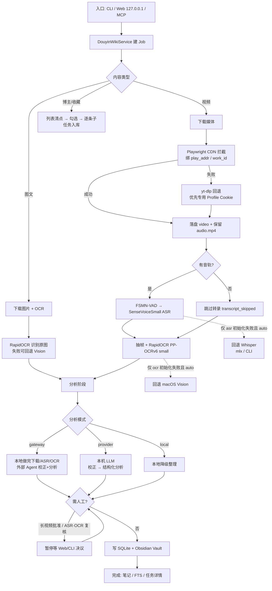

# 抖库端到端主流程（视频入库）

> 按当前代码重画（SenseVoice + RapidOCR；Whisper / Vision 仅初始化回退）。

旁路（认证）：`auth douyin` → 专用 `browser_profile_dir` 登录；CDN 主路径用该 Profile；yt-dlp 侧路仅在 Profile 会话可用时优先，否则回退系统 Chrome Cookie。

说明：`auto` 只在 SenseVoice / RapidOCR **初始化失败**时回退；运行中失败不会换后端。OCR 推理失败写 `ocr_warning` 继续；ASR 推理失败会让任务失败。
