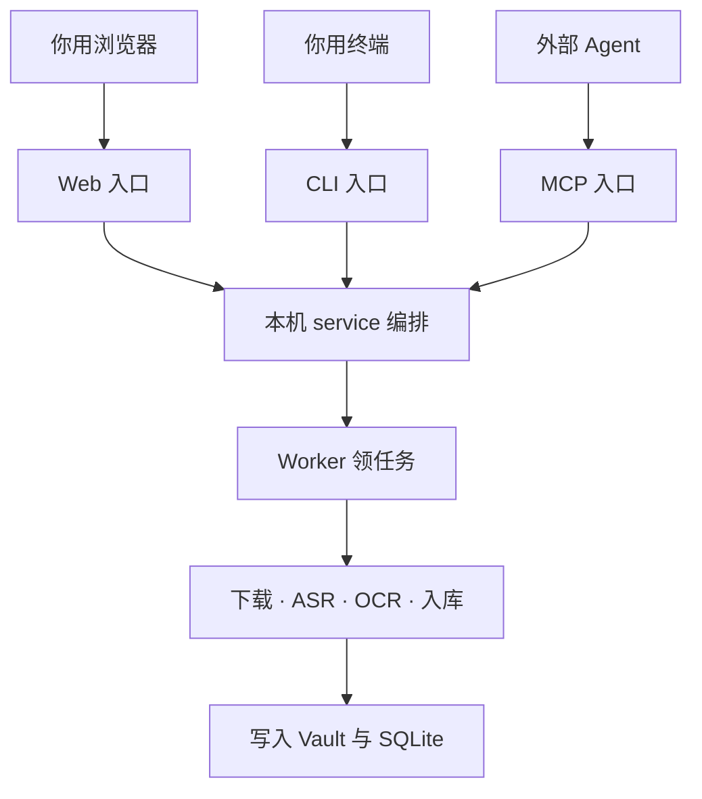

# 抖库入口面流程图（简版）

> `/Users/weisengao/Documents/ChatGPT/douyin-wiki/docs/entry-surfaces-flow.md`  
> 只回答一件事：**Web / CLI / MCP 怎么进同一套本机处理。**

三句话：

1. **Web**：日常点选导入、授权、看任务。  
2. **CLI**：安装、排障、命令行采集。  
3. **MCP**：Agent 调工具。  

三条路进同一个 `service`，后面流程一样。导入后「谁做 AI 分析」是设置项，不画在这张图里。
