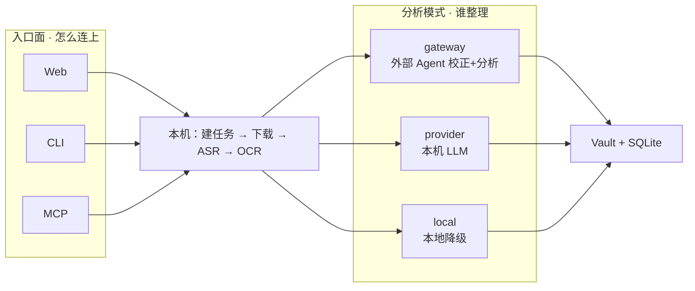

# 入口面 × 分析模式

两轴正交：左边怎么进门，右边谁做 AI 分析。任意入口都能配任意分析模式。

| 组合举例 | 含义 |
|---|---|
| Web + provider | 网页导入，本机模型自动整理（你当前常见用法） |
| MCP + gateway | Agent 调 MCP 建任务，校正分析回 Agent 会话 |
| CLI + local | 命令行导入，不调外部模型 |
