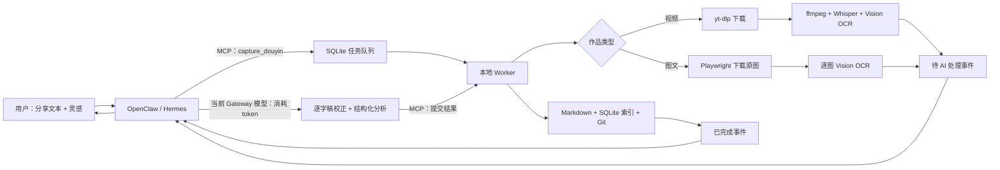

# Gateway Agent 接入指南

抖库默认使用 `analysis_mode = "gateway"`。OpenClaw 或 Hermes 是用户入口和 AI 执行者；
`douyin-wiki` Worker 是不持有会话的本地媒体处理与入库服务。

## 运行边界



本地执行且不消耗 AI token：链接解析、下载、音频提取、ASR、OCR、任务队列、Markdown、
索引和 Git。`gateway` 模式下只有视频逐字稿校正、作品分析以及 Gateway 给用户组织回复时使用
当前 Agent 模型并消耗 token。原视频和原图不会发给模型；模型只收到文字、OCR 和元数据。

## MCP STDIO 配置

先确认本地命令可运行：

```bash
cd /Users/weisengao/Documents/ChatGPT/douyin-wiki
uv run douyin-wiki doctor
uv run douyin-wiki-mcp
```

Hermes 的 MCP 配置可使用本地 STDIO server，并用工具过滤只开放需要的工具。示例：

```yaml
mcp_servers:
  douyin-wiki:
    command: /opt/homebrew/bin/uv
    args:
      - --directory
      - /Users/weisengao/Documents/ChatGPT/douyin-wiki
      - run
      - douyin-wiki-mcp
    tools:
      include:
        - capture_douyin
        - capture_douyin_creator
        - get_creator_inventory
        - set_creator_work_selection
        - confirm_creator_import
        - import_creator_works
        - get_creator
        - list_creators
        - list_creator_works
        - sync_creator
        - get_job
        - get_auth_status
        - list_job_events
        - acknowledge_job_event
        - get_analysis_context
        - submit_transcript_correction
        - resolve_review
        - approve_job
        - retry_job
        - submit_gateway_analysis
        - reanalyze_entry
        - reanalyze_all
        - search_knowledge
        - get_entry
        - add_inspiration
        - confirm_reminder
```

OpenClaw 的 STDIO MCP server 配置示例：

```json
{
  "mcp": {
    "servers": {
      "douyin-wiki": {
        "command": "/opt/homebrew/bin/uv",
        "args": [
          "--directory",
          "/Users/weisengao/Documents/ChatGPT/douyin-wiki",
          "run",
          "douyin-wiki-mcp"
        ]
      }
    }
  }
}
```

配置字段以所用 Gateway 版本为准，可参考 [Hermes MCP 文档](https://hermes-agent.nousresearch.com/docs/user-guide/features/mcp)
和 [OpenClaw MCP 文档](https://docs.openclaw.ai/cli/mcp)。

## Agent 必须执行的工具顺序

当用户发送抖音分享文本与灵感时：

1. 调用 `capture_douyin`。`inspirations` 逐字传递，不得改写；同时传入
   `gateway_context`，至少包含 `gateway`，尽量包含 `channel`、`conversation_id`、
   `message_id` 和 `reply_target`。
2. 立即把 `job_id` 告知用户，不在一个 MCP 调用里等待下载完成。
3. 视频进入“待 AI 处理”且阶段为“逐字稿校正”后，调用
   `get_analysis_context`。只修复明显的同音字、断句、数字、人名和专有名词；不得摘要、
   删句或补写内容。调用 `submit_transcript_correction`，原始 ASR 会保留。
   图文不会出现此阶段，而会直接进入“内容分析”。
4. 若状态变为“需要人工复核”，把疑点、视频时间范围或图文图片编号、原文和建议展示给用户。只有用户修正或
   明确接受不确定内容后，调用 `resolve_review`。
5. 进入“内容分析”后，再次读取上下文，严格按 v2 `analysis_schema` 一次完成分类和
   分析，并调用 `submit_gateway_analysis`。视频原话、图文正文、OCR、AI 推断和用户灵感不得混写；
   事实、数字、日期、参数与方法尽可能写成带时间戳或 `image_index` 的 `knowledge_atoms`。
6. 收到“已完成”或“已完成（有提示）”后，把一句话、AI 推断、提醒候选和原作品
   链接回复到 `gateway_context` 指向的原会话。
7. 每个事件成功处理或投递后调用 `acknowledge_job_event`。确认操作是幂等的。未确认的最新可操作
   事件会保留，可在 Gateway 重启后继续处理；同一任务已经过时的旧事件会自动标记为 superseded。

“需要登录授权”表示视频浏览器 Cookie 失效，或图文专用浏览器需要登录/验证码。本机 Worker 通常已经
显示 macOS 授权引导；用户完成登录后，抖库会验证授权并自动重试相同授权通道中仍然暂停的任务。
Gateway 应先调用 `get_auth_status` 和 `get_job` 复核最新状态，不要反复打开浏览器或重复调用
`retry_job`。若用户选择稍后处理、引导超时或本机弹框不可用，再按任务中的 `auth_scope` 提供手工兜底：
`video` 使用 `uv run douyin-wiki auth video`，`image_note` 或 `creator` 使用
`uv run douyin-wiki auth douyin`；确认授权成功后再调用 `retry_job`。
不得要求用户提供 Cookie；状态接口也不会返回 Cookie 值。

“等待用户确认”表示视频超过 30 分钟。Agent 必须说明继续将消耗当前 Gateway 模型
token，获得用户明确同意后才能调用 `approve_job`。超过 2 小时仍默认拒绝，除非采集时显式
传入 `allow_long=true`。

提醒候选不会自动写入 macOS。只有用户明确同意且时间已解析为绝对时间后，才能调用
`confirm_reminder`，并必须传 `confirmed=true`；重复调用会返回同一个系统提醒 ID。

对已有资料调用 `reanalyze_entry` 或 `reanalyze_all` 时会直接复用校正逐字稿和 OCR，事件从
“内容分析”开始，不需要再次校正，也不会触发下载、ASR 或 OCR。默认跳过 v2 条目，
只有显式 `force=true` 才重新生成。

## 博主选择式批量采集

用户提交博主主页或该博主任意作品时，先调用 `capture_douyin_creator`，并逐字传递博主灵感。
本地 Worker 完成主页清点后，父任务进入“待选择作品”：

1. 调用一次 `get_creator_inventory` 读取全部作品，并在同一条回复中展示固定编号、封面、标题、
   视频/图文类型、时长和发布时间。只有超大清单且用户明确接受分页时才传 `page/limit`。
2. 根据用户的范围、类型、时间或标题条件，用稳定编号或作品 ID 调用
   `set_creator_work_selection`，分别写入“已选入库”与“未入库”。决定保存在 SQLite，不能只记在
   对话上下文里。
3. 还有“待入库”作品时不得确认。确认前汇总待入库、已选入库、未入库和已入库数量；清单不完整时，只有
   用户明确接受后才传 `accept_partial=true`。
4. 调用 `confirm_creator_import` 后才会建立采集子任务。子任务沿用视频/图文的校正与分析流程；
   当事件含 `creator_context.batch_silent=true` 时完成 AI 工作但不逐条刷屏，等待父任务汇总。
5. 用户要重新采集之前跳过的作品时，调用 `import_creator_works`。

只有用户明确要求同步时才能调用 `sync_creator`。它会完整重新清点并只把新增作品放入新一轮
选择清单；没有新增时返回“同步完成：没有发现新作品”。不得为它建立每日、定时或订阅任务。
每个博主的新增资料都写入独立的 `creators/<博主名_短ID>/` 目录，旧资料保持原位并由博主索引链接。

## 事件接续

`list_job_events` 是持久事件游标，不是内存通知。它支持 `after_event_id`、只返回未确认事件，
并携带原始 `gateway_context`。没有 `gateway_context` 的 CLI 任务不会进入投递队列。Gateway 可以选择：

- 在支持后台任务续跑时，把 `job_id` 交给 Gateway 自身的后台任务；
- 使用 Gateway 定时任务调用 `list_job_events`；
- 使用无 Agent 的本地定时器运行 `uv run douyin-wiki jobs events`，再由 Gateway 的事件桥
  唤醒一次 Agent。

最后一种方式的“事件桥”属于 OpenClaw/Hermes 的部署配置，不由本项目自动安装。这样可以让
空轮询不消耗模型 token；只有出现可操作事件时才唤醒 Agent。Hermes 的定时任务与投递能力见
[Hermes Cron 文档](https://hermes-agent.nousresearch.com/docs/user-guide/features/cron/)。

Hermes 的 cron 配置可直接调用抖库 CLI 的监控命令：
`uv run douyin-wiki gateway monitor-events`（请在项目根目录执行）。它在没有未确认事件时不输出任何内容。
Hermes 会对输出做变更检测，未变化时不会启动 Agent。当前机器可用以下命令检查已部署任务：

```bash
hermes mcp test douyin-wiki
hermes cron list
hermes cron runs --limit 10
```

## 推荐 Gateway 系统指令

可把以下内容加入负责此知识库的 Agent 指令：

```text
当消息包含抖音链接且用户给出灵感时，调用 douyin-wiki 的 capture_douyin。
灵感必须逐字传递；capture 时保存当前 gateway/channel/conversation/message 路由。
任务进入“待 AI 处理”后，视频先校正逐字稿，图文直接按返回的 schema 分析；
不得改写灵感，不得把 AI 推断当作作品原话。“需要人工复核”和长视频必须询问用户；
“需要登录授权”时先调用 get_auth_status 和 get_job，等待本机授权引导完成并复核最新状态；
只有自动引导未完成时，才根据授权范围提示用户运行 auth video 或 auth douyin，授权成功后再重试。
完成后把原作品链接、摘要、灵感关联、时间戳或图片编号证据和提醒候选发回原会话。
成功处理每个 job event 后确认该事件。
当用户要求保存某个博主时，调用 capture_douyin_creator，先展示清单并把用户的选择逐项写入；
所有作品选中或跳过后才能确认。只有用户明确要求时调用 sync_creator，绝不自动同步主页。
```

## 调试

```bash
uv run douyin-wiki jobs events
uv run douyin-wiki gateway context JOB_ID
uv run douyin-wiki jobs get JOB_ID
```

如果任务已完成但 Gateway 没有回复，先看未确认事件中是否保留了正确的
`conversation_id`/`reply_target`。如果任务停在“待 AI 处理”，说明本地媒体处理已经
完成，等待 Gateway 调用校正或分析提交工具，而不是 Worker 故障。
