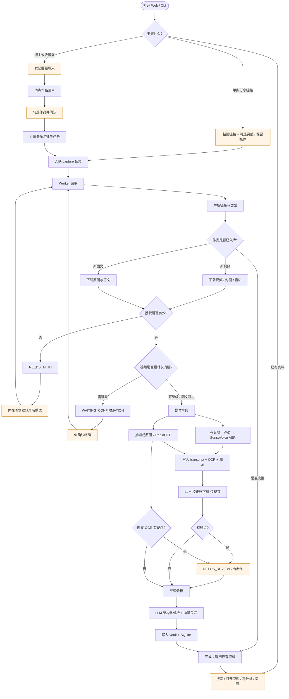

# 抖库操作流程图

> 根目录：`/Users/weisengao/Documents/ChatGPT/douyin-wiki`  
> 视角：**你怎么操作 → 系统做什么**（本机 `analysis_mode=provider`）。  
> 业务泳道细图见 `docs/current-project-flow.md`。

## 操作速查

| 你的操作 | 典型结果状态 |
|---|---|
| 提交单条链接 | `QUEUED` → … → `COMPLETED` |
| 批量清点后勾选导入 | 父任务 `NEEDS_SELECTION` → 子任务走同一采集 |
| 登录失效 | `NEEDS_AUTH` → 登录后 `retry` |
| 超长视频 / AI 分析门槛 | `WAITING_CONFIRMATION` → 确认 |
| 低置信 ASR / OCR 疑点 | `NEEDS_REVIEW` → 校对后继续 |
| 再分析 | 复用逐字稿与 OCR，不重跑 ASR/OCR |

回退：`asr_provider`/`ocr_provider=auto` 时，仅 **初始化失败** 才 Whisper / Vision。
