# 抖库：按仓库路径的模块流程图

> 根目录：`/Users/weisengao/Documents/ChatGPT/douyin-wiki`  
> 按 **路径 / 包边界** 画调用关系（2026-09-27 当前树；含未提交的 `adapters/media_models.py`）。

```mermaid
flowchart TB
    subgraph root ["douyin-wiki/"]
        pyproject["pyproject.toml"]
        readme["README.md / CHANGELOG.md"]
        docs["docs/*.md"]
        tests["tests/"]
        src["src/douyin_wiki/"]
    end

    subgraph entry ["入口路径"]
        main["__main__.py"]
        cli["cli.py<br/>douyin-wiki"]
        mcp["mcp_server.py<br/>douyin-wiki-mcp"]
        worker["worker.py"]
        webapp["webapp/app.py"]
    end

    subgraph core ["核心编排"]
        service["service.py<br/>~4.5k 行门面"]
        config["config.py"]
        models["models.py"]
        database["database.py"]
        vault["vault.py"]
        review["review.py"]
        search["search.py"]
        operation["operation.py"]
        runtime["runtime.py"]
        setup["setup.py"]
        errors["errors.py"]
        secrets["secrets.py"]
    end

    subgraph adapters ["adapters/"]
        media["media.py<br/>下载 / FFmpeg / Whisper / Vision"]
        media_models["media_models.py<br/>SenseVoice / RapidOCR / Selected*"]
        llm["llm.py"]
        embeddings["embeddings.py"]
        share["share.py"]
        creator["creator.py"]
        favorites_ad["favorites.py"]
        image_note["image_note.py"]
        reminders["reminders.py"]
        vision_swift["../resources/vision_ocr.swift"]
    end

    subgraph favorites_pkg ["收藏夹域"]
        favorites["favorites.py"]
        favorites_models["favorites_models.py"]
        favorites_store["favorites_store.py"]
    end

    subgraph web ["Web 层"]
        web_op["web_operation.py"]
        web_auth["web_auth.py"]
        auth_g["auth_guidance.py"]
        op_api["webapp/operation_api.py"]
        catalog["webapp/catalog.py"]
        chat["webapp/chat.py"]
        rendering["webapp/rendering.py"]
        static["webapp/static/*.js"]
        templates["webapp/templates/app.html"]
    end

    subgraph data ["本机数据落点（配置，非 src）"]
        sqlite["vault/.douyin-wiki/state.sqlite3"]
        obsidian["Documents/Obsidian/抖库"]
        cfg["~/Library/Application Support/douyin-wiki/config.toml"]
    end

    pyproject --> entry
    src --> entry
    src --> core
    src --> adapters
    src --> favorites_pkg
    src --> web

    cli --> service
    mcp --> service
    worker --> service
    webapp --> web_op
    web_op --> service
    op_api --> web_op
    catalog --> web_op
    chat --> web_op
    static --> webapp
    templates --> webapp

    service --> config
    service --> models
    service --> database
    service --> vault
    service --> review
    service --> search
    service --> adapters
    service --> favorites_pkg
    service --> auth_g

    media_models --> media
    media --> vision_swift
    service --> media_models
    service --> media
    service --> llm
    service --> embeddings

    config --> cfg
    database --> sqlite
    vault --> obsidian
    worker --> database
```

## 路径速查

| 路径 | 职责 |
|---|---|
| `src/douyin_wiki/cli.py` | CLI 入口 |
| `src/douyin_wiki/worker.py` | 队列领取 → `service.process_claimed_job` |
| `src/douyin_wiki/webapp/` | 本地 Web UI |
| `src/douyin_wiki/service.py` | 业务编排中心 |
| `src/douyin_wiki/adapters/media.py` | 下载、抽音/帧、旧 Whisper/Vision |
| `src/douyin_wiki/adapters/media_models.py` | SenseVoice+VAD、RapidOCR、provider 选择 |
| `src/douyin_wiki/adapters/llm.py` | 校正与结构化分析 |
| `src/douyin_wiki/database.py` | SQLite 任务与索引 |
| `src/douyin_wiki/vault.py` | Obsidian 资料页 / raw / git |
| `docs/current-project-flow.md` | **业务**泳道流程图（非路径图） |
| `docs/service-slim-plan.md` | 拟把 `service.py` 拆到多个 `service_*.py` |

业务步骤级流程图见：`docs/current-project-flow.md`。
